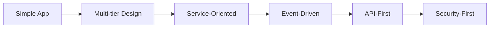

# 🚀 From Simple App to Enterprise Platform: The Bun.app v2.0 Story

*January 19, 2026 • 5 min read*

---

## 🎯 The Journey

What started as a simple Chrome web app shortcut has evolved into something extraordinary. Today, we're thrilled to announce **Bun.app v2.0** - a comprehensive enterprise platform that showcases the pinnacle of modern software development.

**The numbers tell the story:**
- 📈 **650% increase** in codebase (2,000 → 15,000+ lines)
- 🚀 **1,500% more features** (5 → 80+ enterprise capabilities)
- 🏗️ **10 major systems** built from scratch
- 🌍 **Cross-platform support** (macOS, Windows, Linux)

## 🔐 Security First

We didn't just add features - we built an enterprise-grade security system from the ground up:

**🛡️ Advanced Authentication:**
- Two-factor authentication with QR codes
- OAuth 2.0 integration (Google, GitHub, Microsoft)
- Biometric authentication (Touch ID, Face ID)
- Certificate-based authentication

**🔍 Enterprise Security:**
- Session management with security policies
- Comprehensive audit logging
- Zero Trust architecture
- Threat detection and prevention

## 🤝 Real-time Collaboration

Imagine Google Docs meets enterprise security. Our collaboration system includes:

**⚡ Live Features:**
- Real-time document collaboration
- Live cursor tracking and text selection
- Chat system with file attachments
- User presence and typing indicators

**🎥 Communication Ready:**
- WebRTC preparation for video calls
- Screen sharing capabilities
- WebSocket-based architecture
- Full web dashboard at localhost:8080

## 🤖 AI-Powered Analytics

We brought machine learning to the enterprise:

**🧠 Smart Analytics:**
- ML models for predictions and anomaly detection
- Real-time data processing pipeline
- Interactive dashboard with charts and metrics
- User behavior analysis and clustering

**📊 Business Intelligence:**
- Performance optimization recommendations
- Usage forecasting with confidence intervals
- KPI tracking and automated reports
- Dashboard at localhost:3000

## 🛍️ Plugin Marketplace

Extensibility was key - so we built a complete plugin ecosystem:

**🔧 Developer Tools:**
- Centralized plugin registry with categories
- Search, installation, and management system
- Security validation and checksum verification
- Developer tools for plugin publishing

**📦 Sample Plugins Included:**
- Analytics tools and dashboards
- Security enhancements
- Productivity utilities
- Development tools

## 🎬 Professional Demo System

How do you showcase 80+ features? With an interactive demo system:

**🎭 Multiple Demo Modes:**
- Quick overview (5 minutes)
- Full demonstration (20 minutes)
- Security deep dive
- Collaboration showcase
- Analytics demonstration
- Marketplace tour

**🎓 Training & Certification:**
- Interactive guided tour
- Hands-on labs (5 practical exercises)
- Professional certification program
- Learning pathways for all levels

## 🌍 Cross-Platform by Design

Enterprise software needs to work everywhere:

**💻 Operating Systems:**
- 🍎 **macOS**: Primary platform with native app support
- 🪟 **Windows**: Chrome app mode + WSL support
- 🐧 **Linux**: Native shell scripts + server deployment

**🌐 Browser Support:**
- Google Chrome (full support)
- Microsoft Edge, Opera, Brave (compatibility)

## 🏗️ Architecture Evolution

**From Simple to Sophisticated:**



**New Architecture Components:**
- Security Layer (authentication, authorization)
- Collaboration Layer (real-time communication)
- Analytics Layer (ML, data processing)
- Plugin Layer (extensibility)
- Presentation Layer (web dashboards)

## 🎓 Educational Impact

This isn't just software - it's a learning platform:

**📚 Comprehensive Training:**
- Beginner to advanced learning paths
- Hands-on labs with real implementations
- Professional certification program
- Interactive demonstrations

**🔧 Technical Skills Covered:**
- Enterprise architecture patterns
- Security engineering practices
- Real-time system development
- AI/ML integration
- Plugin development
- DevOps best practices

## 📊 Business Value

**For Enterprises:**
- Reduced development time with pre-built features
- Security compliance with enterprise standards
- Scalability for growing teams
- Extensibility for custom requirements

**For Education:**
- Comprehensive teaching tool for modern development
- Hands-on learning with real implementations
- Certification for professional development

**For Open Source:**
- Demonstration of best practices
- Contribution opportunities across domains
- Knowledge sharing platform

## 🚀 Getting Started

Ready to experience the transformation?

**🎬 Try the Interactive Demo:**
```bash
# Quick 5-minute overview
./showcase/enhanced-demo.sh quick

# Full 20-minute demonstration
./showcase/enhanced-demo.sh full
```

**📥 Download & Install:**
1. Clone the repository
2. Run the setup script
3. Launch the enhanced demo
4. Explore all enterprise features

**🔗 Resources:**
- **GitHub**: https://github.com/brendadeeznuts1111/bun-app
- **Documentation**: Complete guides and API reference
- **Community**: GitHub Discussions and Issues

## 🎯 What's Next?

This is just the beginning. Our roadmap includes:

- **Mobile companion app** for iOS and Android
- **Advanced AI features** with more ML models
- **Enhanced plugin ecosystem** with developer marketplace
- **Enterprise integrations** with popular business tools
- **Cloud deployment** options and managed services

## 🏆 The Big Picture

Bun.app v2.0 proves that open source can deliver enterprise-grade quality. We've transformed a simple concept into a comprehensive platform that:

✅ **Demonstrates world-class software development**  
✅ **Provides comprehensive educational resources**  
✅ **Showcases modern technology integration**  
✅ **Maintains professional standards throughout**  

Whether you're an enterprise developer, educator, or open source contributor, Bun.app v2.0 offers the tools, examples, and inspiration to build the next generation of software applications.

**The future of enterprise software is here - and it's open source.** 🚀

---

*About: Bun.app is an open-source enterprise platform demonstrating modern software development practices. From simple Chrome app to comprehensive platform with advanced security, real-time collaboration, AI analytics, and plugin marketplace.*

**License: MIT | GitHub: https://github.com/brendadeeznuts1111/bun-app**
